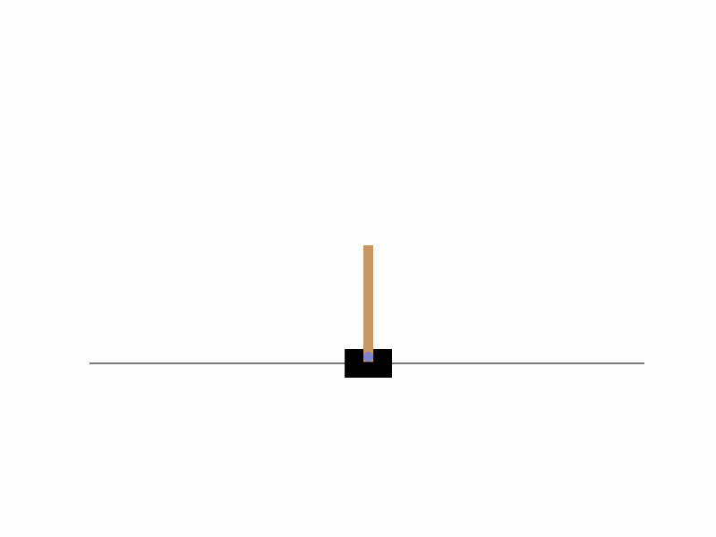
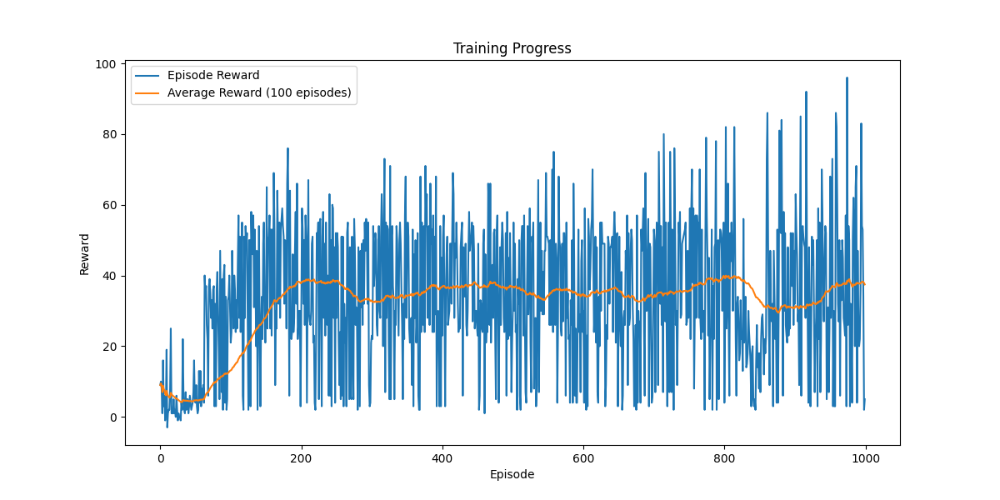

# cartpole-rl

The CartPole problem is a widely used benchmark in reinforcement learning. The goal is to balance a pole attached to a cart by applying left or right forces to the cart. This project aims to implement and compare different RL algorithms to achieve optimal performance.

